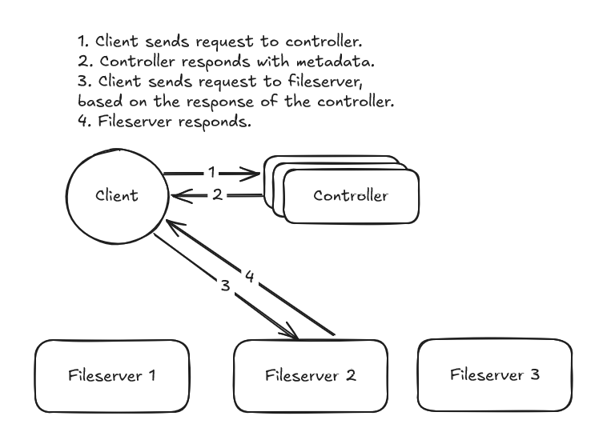

# An implementation of a distributed filesystem, built for personal learning.
### Design

### Bugs
- [x] nonblocking accept

### Features
- [x] single machine fileserver
- [ ] controller for storing metadata
- [ ] client code
- [ ] concurrency handling
- [ ] file chunking
